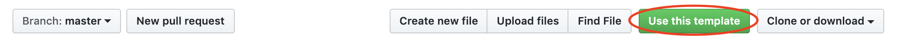

# ☁️ myClubs Backend Challenge

myClubs has grown as a company. To make the growing complexity manageable, we have moved distinct workloads to separate systems.
The workload for this challenge concerns **weather**.

## 😎 Scenario

Outdoor courses are likely to be cancelled if the weather is bad so we want to be able to get a forecast for a specific workout.
The product owner has provided you with some example data for workouts and would like you to implement an API endpoint where they can pass a workout and get a weather forecast for it.

We’re looking for your *personal* solution, so feel free to solve the challenge your own way. Nevertheless, we’re happy to help and answer any questions that arise!

## 📦 Deliverable

Use this repository as a template for your own, and submit you results as pull request on your repository (this way, we can easily see the changes you’ve made):

## 👟 Getting Started

1. The project has already been initialized as a [AWS CDK](https://docs.aws.amazon.com/cdk/api/latest/docs/aws-construct-library.html) typescript project. AWS CDK is software development framework to define cloud infrastructure in code and provision it through AWS CloudFormation. It provides so-called Components to define infrastructure such as an AWS Api Gateway and a Lambda function – which you’ll need for this challenge – without needing to set all of this up manually in the AWS console.
2. If you’re new to AWS CDK, the [typescript workshop’s “Hello CDK” chapter](https://cdkworkshop.com/20-typescript/30-hello-cdk.html) is a good starting point. You don’t have to do everything from scratch, though — the implementation of your task has already been started in `cdk/lib/weather-stack.ts` and `handler/getWeather/getWeather.ts`.
3. You can install the project dependencies with `yarn install`.

### Your Task Implementation

1. Implement a function that takes the `objectId` of an `ActivityDate` (workout), loads the weather forecast from a source of your choice and responds with an object containing the ActivityDate and the weather forecast (💡 see `handler/getWeather/getWeather.ts`).
2. Your weather forecast function should be made available via HTTP(S) endpoint and require an API key to be accessible (💡 see `cdk/lib/weather-stack.ts` and [the CDK documentation](https://docs.aws.amazon.com/cdk/api/v1/docs/aws-apigateway-readme.html)).
